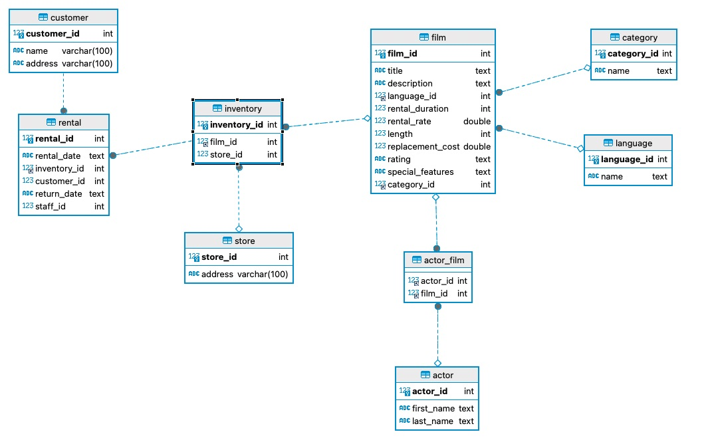

# BLOCKBUSTER: PROYECTO SQL

## CREACIÓN DE UNA BASE DE DATOS DESDE CERO

En este README, se detalla el proceso de creación de una base de datos desde cero utilizando archivos CSV como fuente de datos. 
El gestor de bases de datos utilizado es DBeaver, y se crea una base de datos llamada "blockbuster" con las siguientes tablas: film, actor, film_actor, inventory, rental, language, category, store y customer.

### Exploración y Limpieza de Datos

La exploración de datos en Python es una parte esencial del proceso de preparación de los mismos antes de cargarlos en una base de datos, ya que ayuda a garantizar que sean coherentes, precisos y adecuados para el uso previsto en la base de datos. 
Una vez que los datos se han explorado y limpiado adecuadamente, se pueden cargar en una base de datos y estructurar de manera que sea eficiente y efectiva para consultas y análisis futuros.
Se utilizaron archivos CSV como fuente de datos y se realizaron tareas de limpieza con la biblioteca Pandas.

### Creación de Tablas

Se crearon las tablas necesarias en la base de datos "blockbuster". 
Aquí se enumeran las tablas creadas en un principio (luego, en el Bonus, se agregaron dos tablas más)

    -film
    -actor
    -film_actor
    -inventory
    -rental
    -language
    -category

### Inserción de Datos

Se insertaron los valores de los CSVs limpios  en cada columna de cada tabla para llenar la base de datos con información relevante.

### Establecimiento  de Relaciones

Se establecieron las relaciones entre las tablas 

### Creación de Diagrama de Entidad-Relación

Se creó un diagrama entidad-relación para visualizar la estructura de la base de datos y las relaciones entre las tablas.

### Consultas SQL Ejecutadas

Aquí se muestran las consultas SQL que se ejecutaron:

## Bonus

Además de las tablas mencionadas, también se crearon las siguientes tablas:

### Creación de la tabla "store"

### Creación de la tabla “customer”

### Nuevo Diagrama de Entidad-Relación

